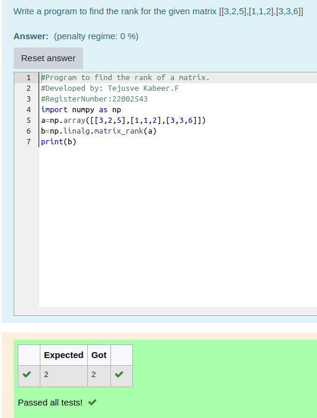

# RANK-OF-A-MATRIX

## Aim:

To write a python program to find the rank of a matrix

## Equipment’s required:

1. 	Hardware – PCs
2. 	Anaconda – Python 3.7 Installation / Moodle-Code Runner

## Algorithm:

### Step 1: 
We have to initialise program using import numpy to perform mathematical calculation.

### Step 2: 
The input from the user is stored in the variable a

### Step 3:
 Using the np.linalg.matrix_rank(), we can find the rank of the given matrix.

### Step 4:
End of the program 

## Program:
```python
#Program to find the rank of a matrix.
#Developed by: Tejusve Kabeer.F
#RegisterNumber:22002543
import numpy as np
a=np.array([[3,2,5],[1,1,2],[3,3,6]])
b=np.linalg.matrix_rank(a)
print(b)
```

## Output:


## Result:
Thus the rank for the given matrix is successfully solved by  using a python program.

